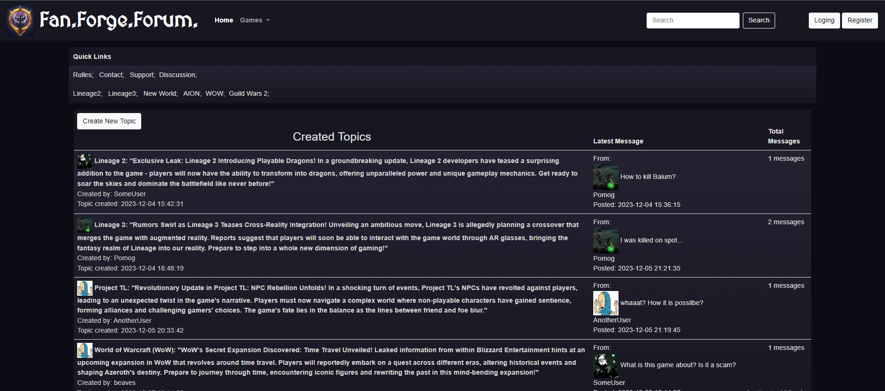

# FFForum
Online forum for MMORPG fans and friends!


## Access the Web Application

The web application can be accessed at the following URLs:

- [AWS Instance](http://ec2-52-91-213-117.compute-1.amazonaws.com/)
- [Direct IP](http://52.91.213.117/login)


## Features
This is a Web Application written in Golang, utilizing only standard [Go libraries](https://pkg.go.dev/std) and the following external packages:
- `github.com/google/uuid v1.4.0`
- `github.com/mattn/go-sqlite3 v1.14.18`
- To run locally use ```go run ./cmd/web .```
- [How to use Docker](docs/howToUsewDocker.md)

### User Management:
- User Registration: Users can create new accounts.
- Guest Registration: Allow guest users to access limited features or explore the platform without registration.
- Login System: Users can log in using their email and password credentials.

### Content Creation:
- Topic Creation: Users can create new discussion topics.
  - Topic Creation with Image: Option to include images when creating topics.
- Post Creation: Users can contribute to discussions by creating posts.
  - Post Creation with Image: Ability to attach images to posts.

### Interaction Features:
- Like/Dislike System: Users can like or dislike posts.
  - User Post Reactions: Each user can react (like/dislike) to a post only once.
- Post and Topic Management:
  - Edit Permissions: Authors can edit their posts and topics.
  - Deletion Permissions: Post authors can delete their posts.

### Search and Sorting:
- Search Bar: Includes a search bar to find topics or content.
- Sorting by Category: Dropdown menu and quick links for sorting topics by category.

### Personal Cabinet:
- User Personal Cabinet: Provides a personal space for each user.
  - Sorting Options:
    - Liked Posts: Users can view posts they've liked.
    - Created Posts: View a list of posts authored by the user.
    - Created Topics: Access topics authored by the user.


### Session
The session feature in this project is implemented using the `github.com/google/uuid` package. A unique UUID (Universally Unique Identifier) token is generated and stored in cookies. On the server side, this token is associated with the user's ID in the SQL database.

#### Implementation Details
1. **UUID Generation:** The `github.com/google/uuid` package is utilized to generate a universally unique identifier for each session.
2. **Cookie Storage:** The generated UUID token is stored in cookies. Cookies provide a convenient and secure way to manage session data on the client side.

### Database
- We are using the SQLite driver. However, our application implements The Repository pattern, and to switch databases, the `DatabaseInt` interface (located in the `repository` package) should be implemented for database systems.
- To compile this go-sqlite3 package on Windows, you must have the gcc compiler installed.
- For example the TDM-GCC Toolchain can be found [here](https://jmeubank.github.io/tdm-gcc/)

#### Database Initialization (`MakeDBTables` and `GetDB`)
- Sets up the SQLite database by creating tables and ensuring a connection.
- Initializes the database and performs checks to ensure connectivity.

### SQL schema


### Template Rendering
- We are using in-memory cache to parse HTML templates
- To turn on caching change AppConfig UseCache to `true`

###  HTTP server `routes` - HTTP request multiplexer
- sets up a basic HTTP server with route handlers for static files and various application endpoints, using the http.ServeMux as the multiplexer.
- The handlers are defined in the handler package, and the `routes` function is responsible for configuring the routing logic for the application.

## Application Structure Overview

### Main Function (`main()`)
- Sets up the server on a specified port.
- Calls the `run()` function for initial setup tasks.
- Configures the HTTP server to listen on the specified port and handle requests using the `routes()` function.

### `run()` Function
- Initializes the application configuration (`config.AppConfig`) and initial data.
- Registers custom types for serialization with the `encoding/gob` package.
- Sets up database tables using `repository.MakeDBTables()`.
- Sets up the repository (`handler.Repo`) and initializes the template cache for HTML rendering.

### `routes()` Function
- Defines routes and their respective handlers using `http.HandleFunc`.
- Handles serving static files (CSS, logos, avatars) using `http.FileServer` and `http.StripPrefix`.

### Repository and AppConfig
- `Repository` holds application configuration and database connections.
- `AppConfig` stores application-specific settings like cache configurations, loggers, and environment flags.

### Handler Functions
- `LoginHandler`, `RegisterHandler`, `HomeHandler`, etc., manage specific HTTP endpoints.
- Examples: `LoginHandler` handles login logic and redirects; `RegisterHandler` manages user registration and interactions with the database; `HomeHandler` deals with displaying home page content and thread creation.

### `forms` Package
- Contains functions for validating form data (e.g., email formats, password lengths).

### Database Interaction (`SqliteBDRepo`)
- Implements methods to interact with the SQLite database.
- Provides functions for user existence checks, fetching user details, creating threads, and handling thread/post queries.

### Template Rendering (`RendererTemplate` and `CreateTemplateCache`)
- Utilizes Go's `html/template` package for rendering HTML templates.
- `RendererTemplate` handles template rendering based on provided data.
- `CreateTemplateCache` sets up and caches HTML templates for efficient rendering.

### Helper Functions and Structs
- Includes helper functions for error handling, template data setup, and managing HTTP responses.
- Defined structs like `User`, `Thread`, `Post`, etc., represent data models used throughout the application.

## Unsolved Issues
1. Not optimized requests to the Database. Sometimes there are several requests per function or method.
2. No Middleware.
3. User's passwords are stored as strings in the Database.
4. No pagination

## Authors
- [Denys Verves](https://github.com/TartuDen)
- [Yurii Panasiuk](https://github.com/pomog)
