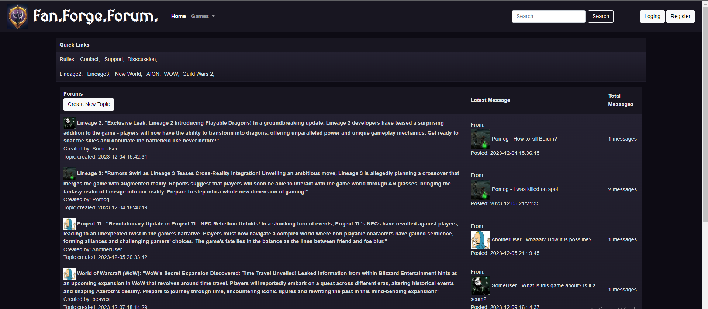

# FFForum
Online forum for MMORPG fans and friends!

## SQL schema

## Authors
- [Denys Verves](https://github.com/TartuDen)
- [Yurii Panasiuk](https://github.com/pomog)

# Project Overview

This project encompasses a server-based application built using Go programming language. The structure and components of the application are as follows:

## Main Function (`main()`)

- Starts the server.
- Initializes the database connection.
- Sets up routes and handlers.
- Listens on a specified port for incoming HTTP requests.

## Database Initialization (`run()`)

- Establishes a database connection and sets up necessary tables.
- Registers custom types for encoding.
- Initializes repositories and handlers.

## Routing (`routes()`)

- Defines the application routes and corresponding handler functions.
- Handles serving static files and HTML templates.

## Handlers (`LoginHandler`, `RegisterHandler`, `HomeHandler`, `ThemeHandler`, `ErrorPage`)

- Perform various tasks based on HTTP requests:
  - Handling user login and registration.
  - Rendering templates.
  - Processing form data and performing validations.
  - Interacting with the database (creating users, threads, posts, etc.).
  - Redirecting users based on certain conditions.

## Form Handling (`Form` and associated methods)

- Represents HTML form data.
- Contains methods for form validation and error handling.
- Checks for required fields, validates field lengths and formats (like email format or password length), and more.

## Configuration (`AppConfig`)

- Holds application configuration settings.
- Manages caching, logging, and production mode status.
- Stores template caches, loggers, and other configuration data.

## Models (`User`, `Thread`, `Post`, `Votes`)

- Define structures representing entities in the application (users, threads, posts, etc.).
- Provide data structures for storing and working with information retrieved from the database.

## Template Rendering (`RendererTemplate`, `CreateTemplateCache`)

- Renders HTML templates using Go's `html/template` package.
- Caches templates for efficient rendering.
- Implements default data and error handling for rendering templates.

## Database Repository (`Repository`, `SqliteBDRepo`, `DatabaseInt`)

- Abstracts database interactions.
- Provides methods for database operations such as user presence check, user creation, thread creation, post creation, etc.
- Implements interfaces for different database interactions and functionality.

